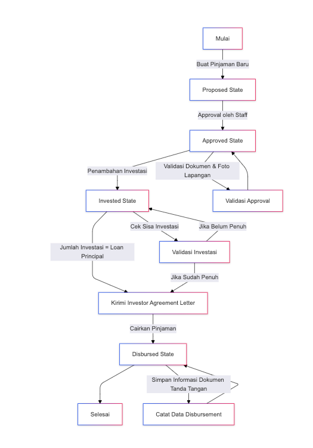
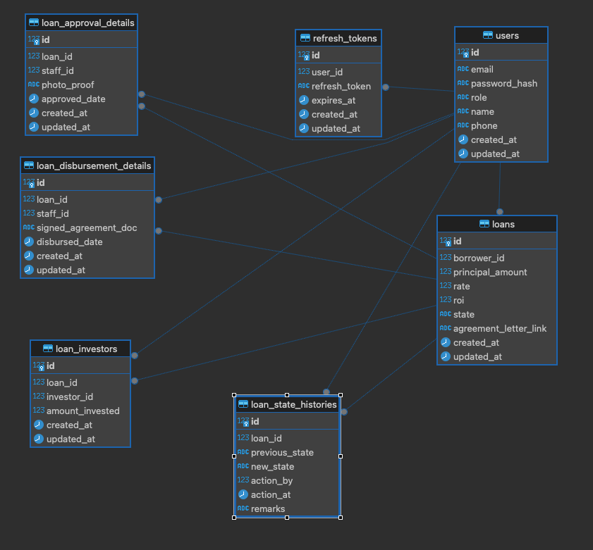
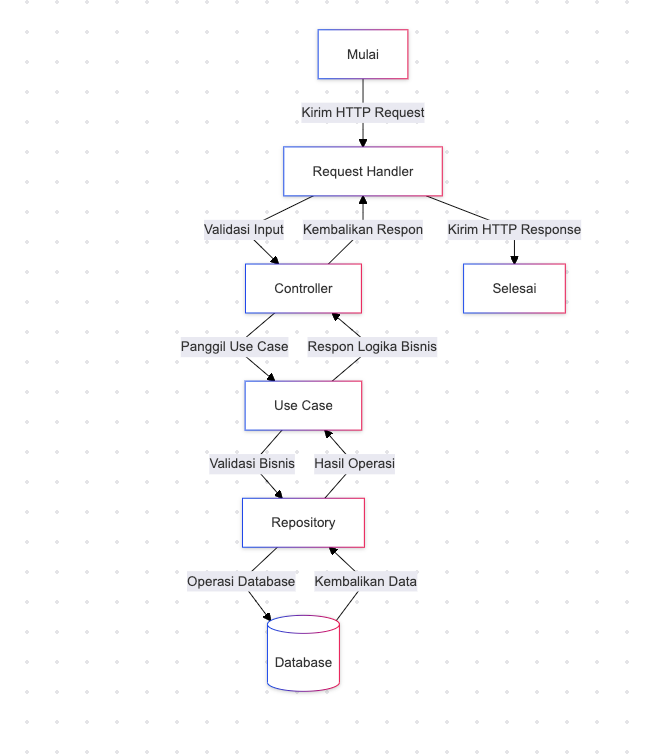

# README #


## Assessment Golang Developer ##
here is my previous mini project called "Loan-Flow".
## Setup
1. Install Go version 1.23
2. Use GoLand (recommended) or any IDE like Visual Studio Code
3. Download dependencies with command `go mod tidy and go vendor`
4. Run docker compose with command `docker-compose up -d`
5. Run Migration for create table into database with `make migrate_up`
6. Create mocks for create mock using mockery `make create_mocks`
7. Run test case `make run_test`

8. Run this command to run API app from root directory:
```shell
go run cmd/api/main.go
```
9. To use the API, please import this collection json to your Postman to test the API
   -> [CLICK HERE TO DOWNLOAD COLLECTION](https://drive.google.com/file/d/128zim6kZddnn4Cd4XdBsZXXzJ36xBM10/view?usp=sharing) <-

---
### High Level Business flow ###

---
### Database Design ###


---
### Architecture and Design ###
this service using onion architecture, there are 5 layers
from inner to outer which are entity, repository, use case,
controller, and request handler. the usage and responsibility of
each layer are follow:
1. **Entity**: this layer contains the domain model or entities
   of the system. These are the core objects that
   represent the business concepts and rules.
2. **Repository**: This layer provides an interface for the
   application to access and manipulate the entities.
   It encapsulates the data access logic and provides
   a way to abstract the database implementation details.
3. **Use case** : This layer contains the business logic
   or use cases of the system. It defines the operations
   that can be performed on the entities and orchestrates
   the interactions between the entities and the repository layer.
4. **Controller**: This layer handles the HTTP requests and
   responses. It maps the incoming requests to the appropriate
   use case and returns the response to the client.
5. **Request handler**: This layer is responsible for handling
   the incoming HTTP requests and passing them on to
   the controller layer.
### Architecture Diagram ###
